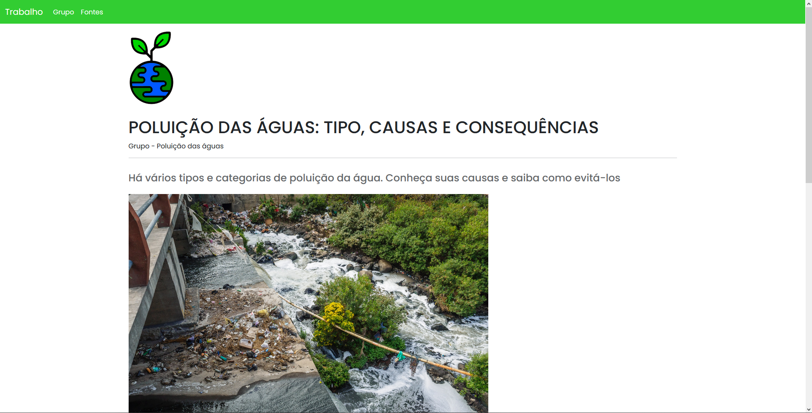

# Water Pollution

<!---Esses são exemplos. Veja https://shields.io para outras pessoas ou para personalizar este conjunto de escudos. Você pode querer incluir dependências, status do projeto e informações de licença aqui--->


<!-- 
 -->




> Site criado para apresentação diferente de trabalho de escola desenvolvido por mim, e com a ajuda do meu grupo com as escritas/conteudo.

## 💻 Pré-requisitos

Antes de começar, verifique se você atendeu aos seguintes requisitos:
<!---Estes são apenas requisitos de exemplo. Adicionar, duplicar ou remover conforme necessário--->
* Você instalou a versão mais recente de `<linguagem / dependência / requeridos>`
* Você tem uma máquina `<Windows / Linux / Mac>`. Indique qual sistema operacional é compatível / não compatível.
* Você leu `<guia / link / documentação_relacionada_ao_projeto>`.

## 🚀 Instalando <nome_do_projeto>

Para instalar o <nome_do_projeto>, siga estas etapas:

Linux e macOS:
```
<comando_de_instalação>
```

Windows:
```
<comando_de_instalação>
```
## 📝 Licença

Esse projeto está sob licença. Veja o arquivo [LICENÇA](LICENSE.md) para mais detalhes.

[⬆ Voltar ao topo](#nome-do-projeto)<br>
